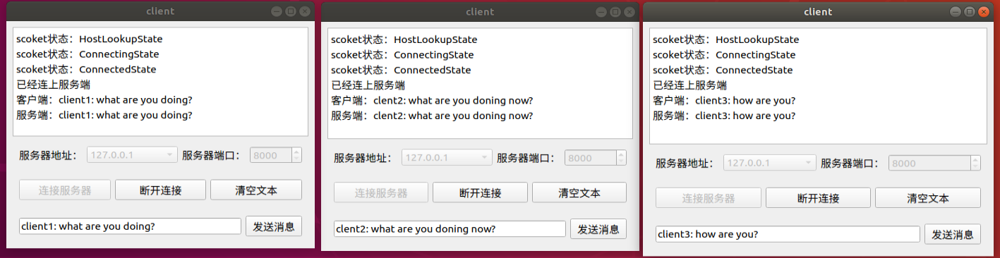

## 使用C++动手实现网络库(参考Muduo)
### 简介
本项目是参考陈硕老师的Muduo网络库，设计一个高并发的网络服务器。主要的应用场景：满足多个客户的不同需求，客户端向服务器发送一个请求，服务器返回与之对应的数据。与原版的Muduo的不同点：
* 去掉了Muduo库中的Boost依赖，完全使用C++标准，如使用std::function<>
* 没有单独封装Thread，使用C++11引入的std::thread搭配lambda表达式实现工作线程，没有直接使用pthread库。类似的直接使用C++11/17的还有std::atomic，std::any等
* 只实现了epoll这一个IO-Multiplexing,没有实现poll/select
* 异步日志模块前端不同与原作者的C++风格，是格式化字符串（fmt）风格，前后端异步日志写入使用陈硕老师双缓冲区的思想实现。由于只用于学习，不支持日志滚动功能
* Buffer部分Muduo库没有提供writeFd方法，本项目加入了writeFd，在处理outputBuffer剩余未发数据时交给Buffer来处理
该项目的目的主要是为了巩固C++，熟悉C++的编程特点。

### 安装使用
进入项目根目录，创建build文件夹进行编译
```
cmake ..
make
```
在项目根目录，将头文件复制到/usr/include/mymuduo
```
cp *.h /usr/include/mymuduo
```
进入lib文件夹，将库复制到/usr/local/lib
```
cd lib
cp libmymuduo.so /usr/local/lib
```

### 编程示例
使用时编程风格与使用muduo一样，以下展示一个简单的MuduoServer,具体代码见example

定义MuduoServer类
```c++
class MuduoServer
{

public:
    MuduoServer(EventLoop* loop, 
                const InetAddress& addr,
                const std::string& name)
        : server_(loop, addr, name),
          loop_(loop)
    {
        server_.setConnectionCallback(
            std::bind(&MuduoServer::onConnection, this, std::placeholders::_1));
        server_.setMessageCallback(
            std::bind(&MuduoServer::onMessage, this, std::placeholders::_1, std::placeholders::_2, std::placeholders::_3)    
        );
        server_.setThreadNum(3);
    }

    void setThreadNum(int threadNum)
    {
        server_.setThreadNum(threadNum);
    }

    void start()
    {
        server_.start();
    }

private:

    void onConnection(const TcpConnectionPtr &conn)
    {
        if(conn->connected())
        {
            LOG_INFO("conn UP : %s", conn->peerAddress().toIpPort().c_str());
        }
        else
        {
            LOG_INFO("conn DOWN : %s", conn->peerAddress().toIpPort().c_str());
            conn->shutdown();
        }

    }

    void onMessage(const TcpConnectionPtr& conn,
                    Buffer *buffer, 
                    Timestamp time)
    {
        std::string msg = buffer->retrieveAllAsString();
        conn->send(msg);
        // conn->shutdown();
    }

    EventLoop *loop_;
    TcpServer server_;
};
```
在main函数中运行MuduoServer
```c++
int main()
{
    EventLoop loop;
    InetAddress addr("127.0.0.1", 8000);
    MuduoServer server(&loop, addr, "EchoServer-01");
    server.start();
    loop.loop();

    return 0;
}   
```
### MuduoServer的使用
进入example/Muduo_server目录
```
cmake .
make
```
### 客户端的使用
客户端是利用QT设计的一个简单页面，直接在QT中打开运行即可。
在本项目中，暂时没有信息编解码部分，所以只是相当于echo命令。

